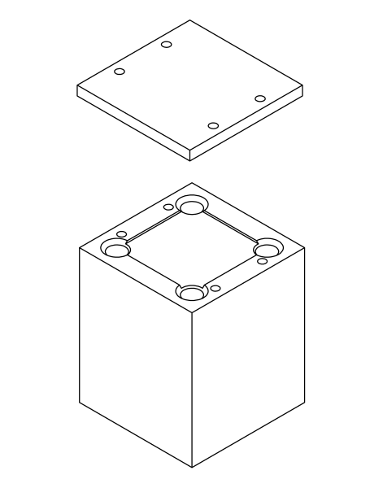

## Raman Spectrum Lidar

This was the first research project I had a hand in. The project was Prof. G. J. Fochesatto's Raman backscattering lidar, which was designed to determine the various fractions of the water phases in the air. Solid water (ice), liquid water (clouds and precipiation), and gaseous water (humidity) all reflect different wavelengths of light when they are excited by a laser. They also reflect other wavelengths but we aren't interested in those here. The reflected wavelengths we are interested in are caused by Raman scattering, which is dependent on the particle structures (such as crystalline with ice and not so in liquid and so on). When you're in really cold climates like that you find in Fairbanks, Alaska, you can have ice particles pretty low in the atmosphere (creating something called ice fog at times). This is of interest for research because not many places experience this phenomenon.

Backing up a minute, a lidar is just like a radar but uses a laser instead of radio waves. So with that in mind, a laser is shot out into the sky, impacts the different particles in the air, such as water, and is reflected back to its source. The reflections are called backscatter. With Raman scattering, the backscattering can also come back in different polarization states. You can split the returning scattering with a cube beam splitter, and just look at one polarization or the other. What I did with this project in particular, was to make a holder for the cube beam splitter in the lidar design. Below is a picture:

